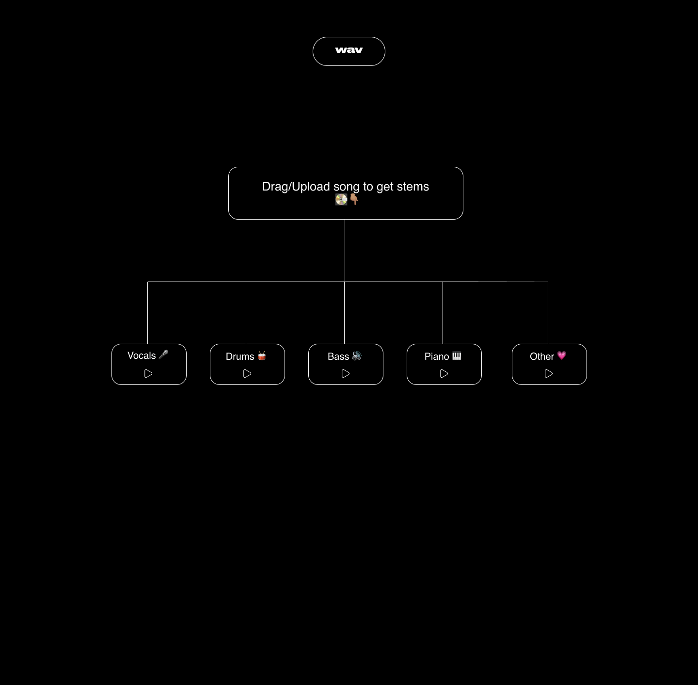

# Wav 

Wav lets you split songs into stems.

It's inspired by the Yeezy Stem player

Wav is built on top of [Deezer's](https://www.deezer.com/en/) source separation library, [Spleeter](https://github.com/deezer/spleeter). 

To split a song, Wav executes Spleeter within a Docker container

### Goals/Roadmap

- Compress output wav stems into the smallest possible size without compromising on audio quality (ffmpeg?)
- Use GPU version of Deezer's Spleeter for faster split times 